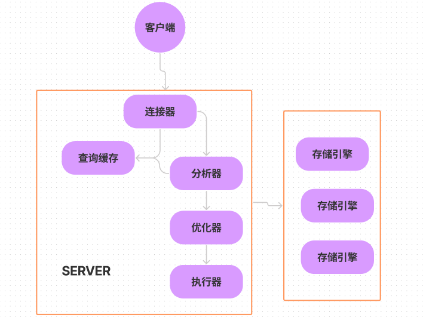

<!-- more -->





​		

MySQL 可以分为 Server 层和存储引擎层两部分。


​	Server 层包括连接器、查询缓存、分析器、优化器、执行器等，涵盖 MySQL 的大多数核心服务功能，以及所有的内置函数（如日期、时间、数学和加密函数等），所有跨存储引擎的功能都在这一层实现，比如存储过程、触发器、视图等。


​	存储引擎层负责数据的存储和提取。其架构模式是插件式的，支持 InnoDB、MyISAM、Memory 等多个存储引擎。现在最常用的存储引擎是 InnoDB，它从 MySQL 5.5.5 版本开始成为了默认存储引擎。

>  create table 建表的时候，如果不指定引擎类型，默认使用的就是 InnoDB


不同的存储引擎共用一个 Server 层，也就是从连接器到执行器的部分


#### 连接器

​	连接数据库时，首先遇到的是连接器。连接器负责跟客户端建立连接、获取权限、维持和管理连接。连接命令一般是这么写的


```shell
mysql -h$ip -P$port -u$user -p
```

输入密码后，就建立连接。如果你没有后续的动作，这个连接就处于空闲状态，你可以在 show processlist 命令中看到它，其中 Command 列显示为“Sleep”的这一行，就表示现在系统里面有一个空闲连接。

图


客户端如果太长时间没动静，连接器就会自动将它断开。这个时间是由参数 wait_timeout 控制的，默认值是 8 小时。


如果在连接被断开之后，客户端再次发送请求的话，就会收到一个错误提醒： Lost connection to MySQL server during query。这时候如果你要继续，就需要重连，然后再执行请求了。数据库里面，长连接是指连接成功后，如果客户端持续有请求，则一直使用同一个连接。短连接则是指每次执行完很少的几次查询就断开连接，下次查询再重新建立一个。建立连接的过程通常是比较复杂的，所以我建议你在使用中要尽量减少建立连接的动作，也就是尽量使用长连接。


#### 查询缓存

​	执行查询语句，下找下缓存，如果没有就会继续后面的执行阶段。执行完成后，执行结果会被存入查询缓存中。你可以看到，如果查询命中缓存，MySQL 不需要执行后面的复杂操作，就可以直接返回结果，这个效率会很高。


#### 分析器

​	

分析器先会做“词法分析”。你输入的是由多个字符串和空格组成的一条 SQL 语句，MySQL 需要识别出里面的字符串分别是什么，代表什么。


#### 优化器

​	优化器是在表里面有多个索引的时候，决定使用哪个索引；或者在一个语句有多表关联（join）的时候，决定各个表的连接顺序。


#### 执行器

​	MySQL通过分析器知道了你要做什么，通过优化器知道了该怎么做，于是就进入了执行器阶段，开始执行语句。


以上是来自《MySQL实战45讲》学习笔记